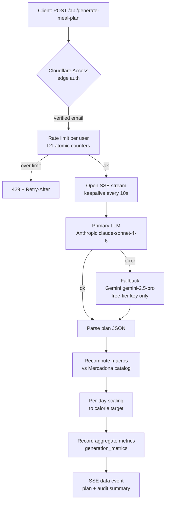

# Nutriplania

Weekly meal planner. A user defines a nutrition profile (calorie/macro targets,
training mode, allergies, disliked ingredients, who eats which meals) and the app
generates a 7-day plan with an LLM. The numbers the user sees are **not** the LLM's
arithmetic: every dish is recomputed against a real supermarket catalog and each day
is scaled to hit the calorie target.

The app is deployed on Cloudflare Pages (static Vue frontend + Pages Functions) and
is gated behind Cloudflare Access.

## Why the macros are recomputed

LLMs are good at composing a varied, constraint-respecting menu and bad at adding up
numbers. Given exact per-100g values in the prompt, the model still drifts on dish
totals. So the generated plan is treated as a **draft of structure**, and the actual
macros are derived deterministically:

1. The LLM proposes dishes with ingredients and weights.
2. Each ingredient is matched to a product in the Mercadona catalog (token overlap,
   accent/plural-insensitive). The catalog macros are the ground truth.
3. A dish is recomputed from its matched ingredients. The recomputed value is trusted
   only when ingredients covering **≥85%** of the dish weight matched a product;
   otherwise the app falls back to the LLM's own numbers for that dish (rather than
   "correcting" with an incomplete reference).
4. Per day, if the recomputed total drifts more than **5%** from the user's target, the
   ingredient amounts for that day are scaled by a single factor and re-derived. Days
   that already fall within 5% are left untouched.

Catalog entries with implausible macros (OCR errors: kcal > 920, or P+C+F > 105g per
100g, negatives, nulls) are filtered out before matching, with manual overrides for
known-broken entries.

The recalculator (`functions/api/_recalculate.js`) is built as a factory
(`createRecalculator(products)`) so it is bound to the real catalog in production and to
a small fixture in tests.

## Generation pipeline



### Streaming (SSE)

Generation can take longer than Cloudflare's ~100s proxy timeout. The endpoint returns
the response headers immediately and streams: a keepalive comment every 10s while the
model works, then a single `data:` event with the final plan and an audit summary. The
client reads the last `data:` line.

### Provider fallback

The primary provider is Anthropic. On failure the request falls back to Gemini using
**only** the free-tier key (`GEMINI_API_KEY`) — failed meal-plan attempts never hit the
billed key. The billed backup key (`GEMINI_API_KEY_BACKUP`) is reserved for other
endpoints (chat/translate).

## Authentication

The whole site is behind **Cloudflare Access**. Server code resolves the user's email
in `functions/api/_auth.js`:

- **Primary:** the `Cf-Access-Authenticated-User-Email` header injected by Access (trusted).
- **Fallback:** the `CF_Authorization` JWT cookie — used when the header isn't forwarded.
  This cookie is attacker-controllable, so it is **cryptographically verified**: RS256
  signature checked against the team's JWKS (`crypto.subtle`, no npm deps), with `exp`/`nbf`
  and (when configured) `aud` validation. The JWKS is cached in-memory (10 min TTL) with a
  single forced re-fetch on a key-id miss. Anything that doesn't fully verify fails closed.

## Rate limiting

The generation endpoint is the only paid operation, so it is rate-limited **per user**
(by verified email): **10 generations/hour and 30/day**. Counters live in D1 and are
incremented atomically (`INSERT … ON CONFLICT … RETURNING`). Exceeding either window
returns `429` with a `Retry-After` header and a message tied to the binding window.
The counter is bumped before the LLM call (it caps cost, so it counts attempts, not just
successes). The limiter **fails open**: a D1 hiccup never blocks a legitimate generation.

## Storage and sync

User data (the full Pinia state: weeks, profile, favorites) is stored server-side in D1,
one JSON blob per user keyed by email. The client loads it on startup and autosaves
(debounced) on every change. Saving is blocked until the initial load succeeds, so a
transient load failure can't overwrite real data with an empty default state. A one-time
migration imports any data left in the old `localStorage` key.

Two safety nets against data loss:

- **`user_data_backups`** — before each overwrite the previous blob is snapshotted when the
  new payload shrinks by >30% or every 6h, keeping the latest 20 per user.
- **D1 Time Travel** — Cloudflare's 30-day point-in-time recovery for the whole database.

## Sharing

A user can share a week as a public read-only page.

- `POST /api/share` (authenticated) stores the week blob in D1 under a random id
  (unbiased `crypto.getRandomValues`), with a 30-day TTL, associated with the creator's
  email, and a payload size limit.
- `GET /shared/:id` is a Pages Function that reads D1 directly and renders the plan as
  self-contained HTML (server-rendered, inline CSS, no scripts, no SPA assets) — days,
  meals, per-dish macros, ingredients, and recipes in a collapsible `<details>`. All
  plan-derived strings are HTML-escaped. Expired links return `410`, unknown ids `404`.
- Because the page is self-contained, only `/shared/*` (and the JSON endpoint
  `/api/shared/*`) need a **Bypass** policy in Access so logged-out visitors can open links.

## Observability

Each successful generation writes an aggregate, numeric-only row to `generation_metrics`
(model, provider, outcome, dishes total/matched, average kcal drift, scalings, forbidden-
ingredient hits). No personal data and no plan content are stored. Writes are best-effort
and never block the response. This is the source of truth for recalculation health.

## Stack

- **Frontend:** Vue 3 + Vite, Pinia, Vue Router, vue-i18n (Spanish/English), Tailwind CSS.
- **Backend:** Cloudflare Pages Functions.
- **Data:** Cloudflare D1 (SQLite). Schema in [`schema.sql`](schema.sql).
- **LLM:** Anthropic (primary) with Gemini fallback.
- **Auth:** Cloudflare Access.

Besides generation, there are LLM-backed endpoints for regenerating a single meal,
translating dishes, importing a recipe, batch-cooking tips, and nutrition/dish chat.

## Tests

Unit tests with Vitest, focused on the deterministic recalculator (amount parsing,
product matching, plausibility filter, dish recompute, ingredient scaling, day-level
scaling to target). Tests run the recalculator against a fixture catalog, not the real
one, so they don't break when the catalog changes.

```bash
npm test          # vitest run
npm run test:watch
```

## Project layout

```
functions/
  api/
    generate-meal-plan.js   # SSE generation: LLM -> recalc -> day scaling -> metrics
    _llm.js                 # Anthropic primary caller (streaming)
    _gemini.js              # Gemini fallback (key + model cascade)
    _recalculate.js         # createRecalculator(): catalog matching + macro recompute
    _recalculate.test.js    # Vitest unit tests
    _auth.js                # Access email resolution + JWT signature verification
    _mercadona-data.js      # product catalog (macros)
    _catalog-overrides.js   # manual fixes for broken catalog entries
    data.js                 # per-user blob read/write + backups
    share.js                # create a share (auth, TTL, size limit)
    shared/[id].js          # API: shared plan as JSON
    ...                     # regenerate-meal, translate-dishes, chat, import-recipe, batch-cooking
  shared/
    [id].js                 # public HTML view of a shared plan (/shared/:id)
src/
  components/               # Vue components grouped by feature
  composables/              # theme, week navigation, language, generation
  services/                 # client wrappers for the API
  stores/dietStore.js       # Pinia store (synced to D1)
  utils/                    # date / nutrition / catalog helpers
  views/                    # routed pages
schema.sql                  # D1 schema (user_data, user_data_backups, shared_plans,
                            #            generation_metrics, rate_limits)
```

## Running locally

```bash
npm install
npm run dev          # Vite dev server (frontend only)
```

The Functions (LLM proxy, D1, auth) need Wrangler and a D1 binding:

```bash
npx wrangler pages dev -- npm run dev
```

Put secrets in a `.dev.vars` file (gitignored). See "Environment variables" for the keys.

## Environment variables

Set these in the Pages project (Settings → Environment variables, for Production and
Preview) and in `.dev.vars` for local development. **Do not commit real values — this repo
is public.**

| Variable | Required | Purpose |
|---|---|---|
| `ANTHROPIC_API_KEY` | yes | Primary LLM for meal-plan generation, regenerate-meal, import-recipe, batch-cooking. |
| `GEMINI_API_KEY` | yes | Gemini (free-tier). The only key used for meal-plan fallback; also used (with the backup key) by chat/translate. |
| `GEMINI_API_KEY_BACKUP` | optional | Additional billed Gemini key for the chat/translate endpoints. Never used for meal-plan fallback. |
| `ACCESS_TEAM_DOMAIN` | yes* | Cloudflare Access team domain, used to build the JWKS URL for cookie JWT verification. |
| `ACCESS_CERTS_URL` | optional | Full JWKS URL; overrides `ACCESS_TEAM_DOMAIN` if set. |
| `ACCESS_AUD` | recommended | Access application AUD tag; enables `aud` validation on the JWT. |

\* Without `ACCESS_TEAM_DOMAIN` (or `ACCESS_CERTS_URL`) the cookie-JWT fallback fails closed
(returns 401). The trusted `Cf-Access-Authenticated-User-Email` header path still works when
present.

## Deploying

The Pages project is direct-upload (not Git-connected):

```bash
npm run build
npx wrangler pages deploy dist --project-name=diet-planner --branch main
```

Apply the schema to D1 (`schema.sql`) and, in Cloudflare Access, gate the site and add
**Bypass** policies for `/api/shared/*` and `/shared/*` so shared links work without login.
